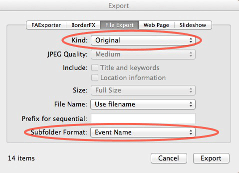

exportiphoto
============

Exports an iPhoto library to a folder structure, optionally writing
metadata to the copies.

This script has been tested with iPhoto 8.1.2 (from iLife '09); other versions
may or may not work.

Originally written by [Derrick Childers](https://github.com/derrickchilders) and
[posted to macosxhints](http://www.macosxhints.com/article.php?story=20081108132735425).
Modifications by
[Guillaume Boudreau](http://github.com/gboudreau),
[Brian Morearty](http://github.com/BMorearty),
[Mark Nottingham](http://github.com/mnot),
[Duoglas Du](http://github.com/duoglas),
[Avinash Meetoo](http://github.com/avinash),
[J.G. Field](http://gitub.com/jgfield),
[Nathan Schwarz](https://github.com/nathanschwarz), and
[Alex Szatmary](https://github.com/AlexSzatmary)

Notes by Alex Szatmary
----------------------
I made the following changes:
* Converted from Python 2 to 3
* Formatted and made pass flake8
* Switched from pyexiv2 to exiftool (run through subprocess)
* Changing which tags are written
* Removed jsversion introduced by [Nathan Schwarz](https://github.com/nathanschwarz)

In 2023, exporting iPhoto 8 albums is a niche application. It seems that for the past
few years, each user picked up this package, modified it for their needs, and posted
their progress on GitHub. My modifications were significant; although I did not
knowingly break prior functionality, some features might not work now. If this program
does not work for you, message me on GitHub and I'll see if I can fix it.

Previous implementations depended on exiv2 and pyexiv2, which are not yet supported well
on Apple Silicon (AKA ARM, M1, M2). I wanted something that would get files into modern
Photos with minimal hassle on a modern Mac.

Details on metadata are described in "Writing Metadata" below.

iPhoto 9 can export photos
--------------------------

Great news. If you upgrade to iPhoto 9.4.3 or later, [you can export dirctly out of
iPhoto to a folder structure](https://discussions.apple.com/message/24759040#24759040).
You don't need to use exportiphoto.

Here's how:

1. Choose File &rarr; Export from the menu.
2. Choose Kind: Original or JPEG. If you want the original picture at
   their original resolution, use Original. If you want to include all
   edits, use JPEG and check both checkboxes to get the keywords,
   titles, etc. included in the file.
3. Choose Subfolder Format: Event Name.

Usage
-----

1. Run this:

        python exportiphoto.py [options] "iPhoto-Library-dir" "destination-dir"

    See example below.

    Options include:

        -a, --albums      use albums instead of events
        -m, --metadata    write metadata to images
        -f, --faces       store faces as keywords (requires -m)
        -q, --quiet       use quiet mode
        -d, --date        stop using date prefix in folder name
        -o, --originals   export original images instead of edited ones
        -x, --deconflict  deconflict export directories of same name (without
                          this, two events with the same name on the same date
                          are merged.)
        -y, --yeardir     add year directory to output
        -e DATE_DELIMITER, --date_delimiter=DATE_DELIMITER
                          date delimiter default=-
        -i, --import      import missing albums from dest directory
        -z IMPORT_FROM_DATE, --import_from_date=IMPORT_FROM_DATE
                          only import missing folers if folder date occurs after
                          (YYYY-MM-DD). Uses date in folder name.
        -t, --test        dont actually copy files or import folders

2. There is no step 2

Note that the -m flag is only available if extra libraries are installed;
see below.

If you are facing encoding problems like "UnicodeEncodeError", try -q flag to stop the console output;

Output
------

By default, exportiphoto exports Events.  It can export Albums instead; use
the -a option on the command line.

It creates a separate folder on disk for each event.  Every folder is prefixed by the
event date in this format: yyyy-mm-dd (because this format is sortable by name) unless
you use the -d option. If the event has a name it is appended to the end of the folder
name.

Example
-------

Let's say you have the following events in iPhoto--two unnamed and one named:

    Jun 10, 2009
    Charlie's Birthday Party
    Jun 20, 2009

Run:

    python exportiphoto.py "$HOME/Pictures/iPhoto Library/" "$HOME/iPhoto Export"

If Charlie's birthday party was on June 15th, the output folders will be:

    2009-06-10
    2009-06-15 Charlie's Birthday Party
    2009-06-20

If you set the -d option to turn off the prepended date, the folder names will be:

    Jun 10, 2009
    Charlie's Birthday Party
    Jun 20, 2009

Writing Metadata
----------------

If [exiftool](https://exiftool.org/) is installed, exportiphoto can write iPhoto
metadata into images as they're exported, with the -m option. Currently, it writes:

 - iPhoto Title, to Title and ObjectName, read in Photos as Title
 - iPhoto Caption, to MWG:Description, read in Photos as Caption
 - iPhoto Comment, to UserComment, not used in Photos
 - iPhoto Keywords, to MWG:Keywords, read in Photos as Keywords
 - iPhoto Rating to XMP-xmp:Rating and to a [keyword from 1* to 5*****](https://discussions.apple.com/docs/DOC-8531)
